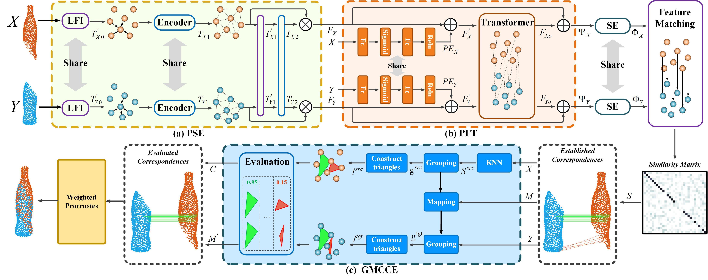

# Full Transformer Framework for Rpbust Point Cloud Registration with Deep Information Interaction



This repository contains python scripts for training and testing [Deep Interaction Transformer (DIT)]

Deep Interaction Transformer (DIT) is a full Transformer framework for point cloud registration, which achieves superior performance compared with current state-of-the-art learning-based methods in accuracy and robustness. DIT consists of the following three main modules:

- a Point Cloud Structure Extractor for modeling global relation.
- a Point Feature Transformer for improving the discrimination of features.
- a GMCCE for correspondence confidence evaluation.

## Configuration

This code is based on PyTorch implementation, and tested on:

- Ubuntu 18.04
- CUDA 11.1
- pytorch 1.8.1
- python 3.7.10

You can install the python requirements on your system with:
```bash
cd DIT
pip install -r requirements.txt
```
  
## Training

Run the relevant commands below. We use the ModelNet40 dataset for this work, which will be automatically downloaded if necessary.
Train the DIT on the clean point clouds as
  
```bash
cd DIT/experiments
sh 1_train_clean.sh
```
  
Train the DIT on the low noise partial-to-partial point clouds as
  
```bash
cd DIT/experiments
sh 1_train_low_noise_partial.sh
```

Train the DIT on the high noise partial-to-partial point clouds as
  
```bash
cd DIT/experiments
sh 1_train_high_noise_partial.sh
```
  
## Evaluation

We provide
- pretrained models on ModelNet40 in clear, low noise partial, high noise partial point clouds. You can download it from this link [weight](https://drive.google.com/file/d/1vwtnSG3YAeVRRgCBVaRAIn_mC6Nnb7-U/view?usp=sharing). Unzip and place it in the [checkpoints/models](checkpoints/models) folder.
  
Evaluate the DIT by running the relevant commands below.
If you want the evaluate the training result, you can change the model path in sh file.
  
Evaluate the DIT on the clean point clouds as
  
```bash
cd DIT/experiments
sh 1_eval_clean.sh
```
  
Evaluate the DIT on the low noise partial-to-partial point clouds as
  
```bash
cd DIT/experiments
sh 1_eval_low_noise_partial.sh
```
  
Evaluate the DIT on the high noise partial-to-partial point clouds as
  
```bash
cd DIT/experiments
sh 1_eval_high_noise_partial.sh
```
